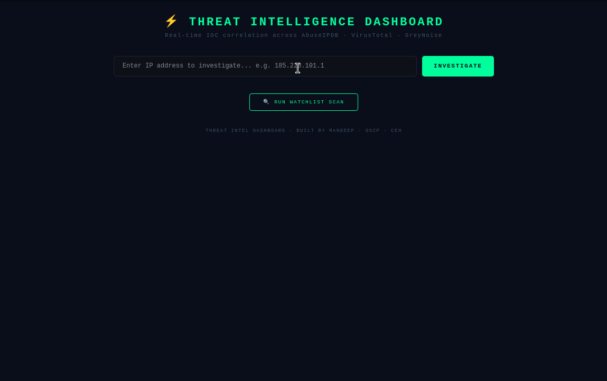
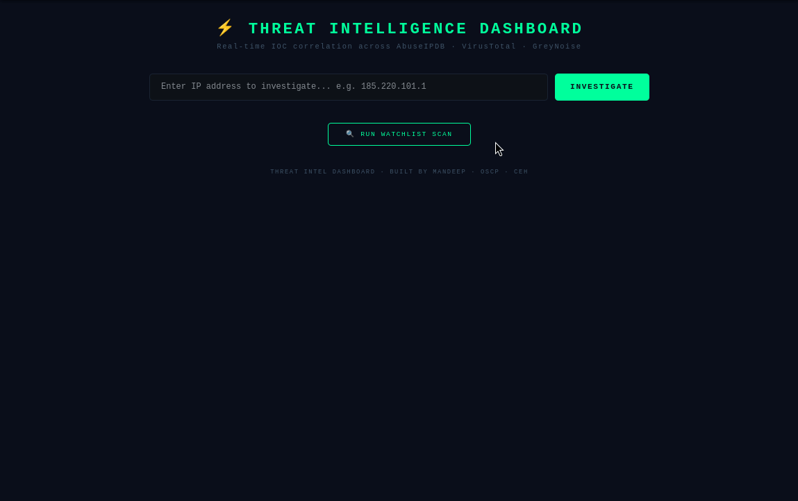

# ⚡ Threat Intelligence Dashboard


A real-time threat intelligence platform that ingests multiple OSINT feeds,
correlates Indicators of Compromise (IOCs), and triggers alerts via a web dashboard.

Built as part of a cybersecurity portfolio by **Mandeep** (OSCP | CEH).

---

## 📺 Demo

### IP Investigation


### Watchlist Scan & Alerts


---

## 🔍 Features

- **Multi-Feed IOC Correlation** — Queries AbuseIPDB, VirusTotal and GreyNoise simultaneously
- **Unified Threat Scoring** — Combines results into a single threat score (0–9)
- **Threat Verdict** — Classifies IPs as MALICIOUS, SUSPICIOUS or CLEAN
- **Web Dashboard** — Clean SOC-style interface built with Flask
- **Watchlist Alert System** — Monitor IPs and get alerted on threats
- **Dockerized Deployment** — Run anywhere with a single command

---

## 🏗️ Architecture
```
threat-intel-dashboard/
├── feeds/
│   ├── abuseipdb.py          ← AbuseIPDB feed
│   ├── virustotal_feed.py    ← VirusTotal feed
│   └── greynoise_feed.py     ← GreyNoise feed
├── templates/
│   └── index.html            ← Web dashboard UI
├── reports/
│   └── alerts.json           ← Generated alerts
├── correlator.py             ← IOC correlation engine
├── alerts.py                 ← Watchlist alert system
├── main.py                   ← Flask web app
├── watchlist.txt             ← IPs to monitor
├── Dockerfile                ← Docker configuration
└── docker-compose.yml        ← Docker compose setup
```

---

## ⚙️ Tech Stack

| Tool | Purpose |
|------|---------|
| Python 3.11 | Core language |
| Flask | Web dashboard |
| AbuseIPDB API | IP abuse reports |
| VirusTotal API | Malware & IP analysis |
| GreyNoise API | Internet noise classification |
| Docker | Containerized deployment |

---

## 🚀 How to Run

### Option 1 — Local
```bash
# Clone the repo
git clone https://github.com/Secure-With-Mandeep/threat-intel-dashboard.git
cd threat-intel-dashboard

# Create virtual environment
python3 -m venv venv
source venv/bin/activate

# Install dependencies
pip install -r requirements.txt

# Add your API keys
cp .env.example .env
nano .env

# Run the app
python main.py
```

Visit `http://127.0.0.1:5000`

### Option 2 — Docker
```bash
docker-compose up --build
```

Visit `http://127.0.0.1:5000`

---

## 🔑 API Keys Required

| Service | Free Tier | Link |
|---------|-----------|------|
| AbuseIPDB | ✅ 1000 checks/day | [abuseipdb.com](https://abuseipdb.com) |
| VirusTotal | ✅ 500 checks/day | [virustotal.com](https://virustotal.com) |
| GreyNoise | ✅ Community tier | [greynoise.io](https://greynoise.io) |

---

## 📊 Key Findings

During testing the following threats were detected:

| IP | AbuseIPDB Score | VirusTotal | GreyNoise | Verdict |
|----|----------------|------------|-----------|---------|
| 185.220.101.1 | 100% | 12 malicious | MALICIOUS | 🔴 MALICIOUS |
| 185.220.101.2 | 100% | 10 malicious | MALICIOUS | 🔴 MALICIOUS |
| 193.32.162.157 | 85% | 6 malicious | MALICIOUS | 🔴 MALICIOUS |
| 8.8.8.8 | 0% | 0 malicious | BENIGN | 🟢 CLEAN |

---

## 👨‍💻 Author

**Mandeep** — Cybersecurity Professional | OSCP | CEH
- GitHub: [@Secure-With-Mandeep](https://github.com/Secure-With-Mandeep)

---

## 📄 License

MIT License — feel free to use and modify.
